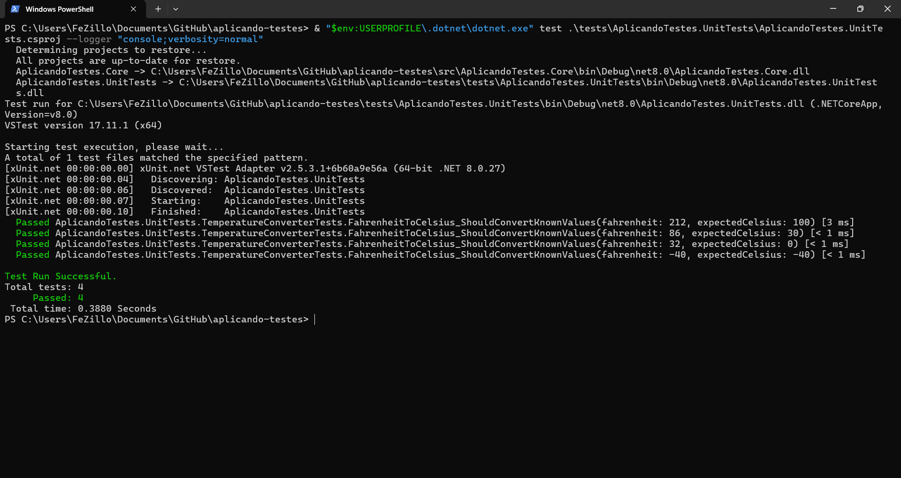
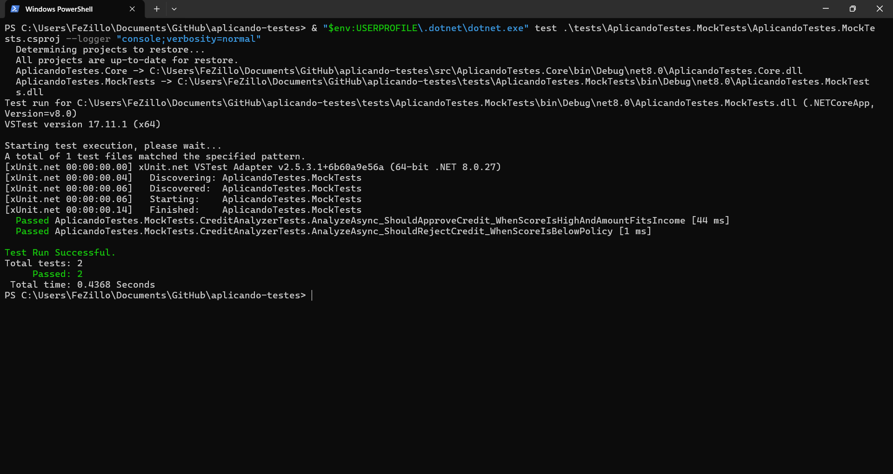
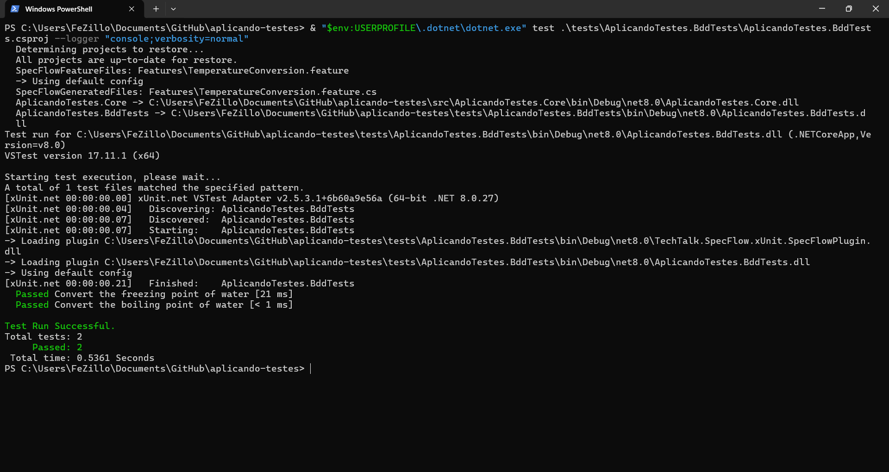

# Aplicando Testes

Projeto criado para aplicar, versionar e documentar os tipos de testes apresentados no artigo [Testes de Software com .NET 5: exemplos de utilizacao](https://renatogroffe.medium.com/testes-de-software-com-net-5-exemplos-de-utiliza%C3%A7%C3%A3o-9b5514119ba2).

Os exemplos usam .NET, xUnit e a mesma ideia central do tutorial: validar uma regra de conversao de temperaturas, simular dependencias com mock objects e escrever cenarios em formato BDD.

## Testes de Unidade

Os testes de unidade validam uma regra isolada do sistema, sem acesso a banco de dados, rede ou servicos externos. Neste projeto, a classe `TemperatureConverter` converte valores em Fahrenheit para Celsius, e o projeto `AplicandoTestes.UnitTests` usa xUnit com `[Theory]` e `[InlineData]` para testar varios valores de entrada no mesmo metodo.

Essa abordagem e indicada quando a regra e deterministica e pequena o bastante para ser verificada rapidamente. Assim, qualquer alteracao indevida na formula de conversao causa falha imediata no teste.

**Cenarios de exemplo:**

1. Converter `32 F` deve retornar `0 C`, cobrindo o ponto de congelamento da agua.
2. Converter `212 F` deve retornar `100 C`, cobrindo o ponto de ebulicao da agua.

## Mock Objects

Mock objects simulam dependencias que seriam caras, lentas ou instaveis em um teste automatizado. Neste projeto, `CreditAnalyzer` depende de `ICreditScoreService` para consultar um score de credito; nos testes, essa interface e substituida por um mock criado com Moq.

Com isso, o teste controla exatamente o retorno da consulta de score e valida apenas a regra de negocio da analise de credito. O uso de Fluent Assertions deixa as verificacoes mais legiveis, enquanto o `Verify` do Moq confirma que a dependencia foi chamada como esperado.

**Cenarios de exemplo:**

1. Quando o score mockado e `820` e o valor solicitado respeita a renda, a analise deve aprovar o credito com risco baixo.
2. Quando o score mockado e `420`, a analise deve rejeitar o credito com risco alto, mesmo que a renda seja suficiente.

## Testes BDD com SpecFlow

Os testes BDD descrevem o comportamento esperado em uma linguagem proxima da regra de negocio. Neste projeto, o arquivo `TemperatureConversion.feature` contem os cenarios em formato Gherkin, e a classe `TemperatureConversionSteps` mapeia cada frase para chamadas reais ao codigo C#.

Essa abordagem e util quando o teste precisa comunicar claramente o comportamento para pessoas tecnicas e nao tecnicas. O SpecFlow transforma os cenarios do arquivo `.feature` em testes automatizados executados pelo xUnit.

**Cenarios de exemplo:**

1. Dado `32 F`, quando o valor e convertido para Celsius, entao o resultado deve ser `0 C`.
2. Dado `212 F`, quando o valor e convertido para Celsius, entao o resultado deve ser `100 C`.

## Barema

(De 0 a 3) - Implementacao dos 3 tipos de testes apresentados no artigo (1 ponto para cada tipo de teste implementado)

(De 0 a 2) - Explicacao clara e objetiva sobre a aplicacao dos testes

(De 0 a 2) - Organizacao do arquivo readme, com imagens dos testes e coerencia dos textos.
